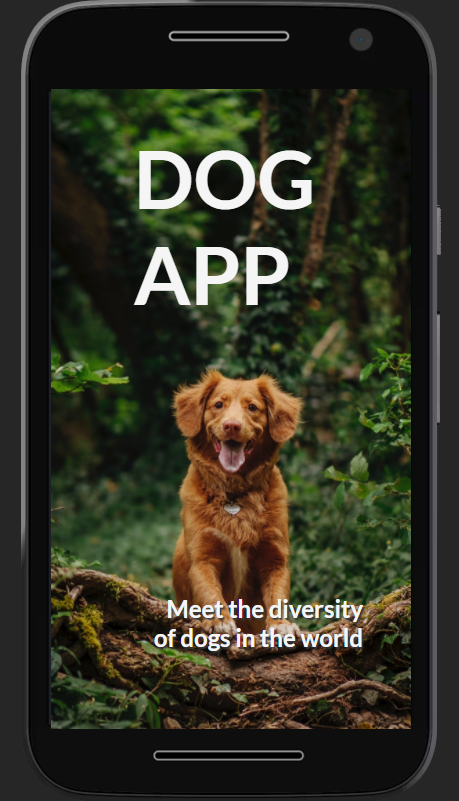
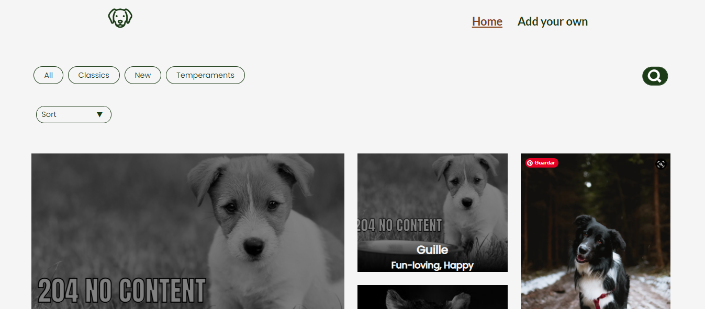
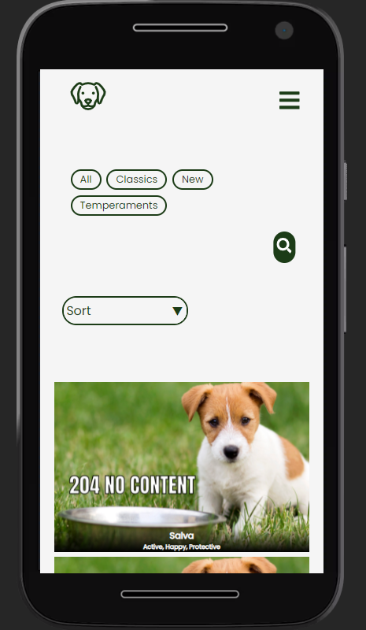
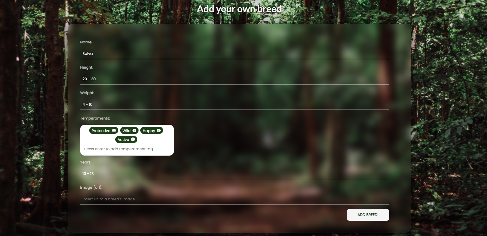
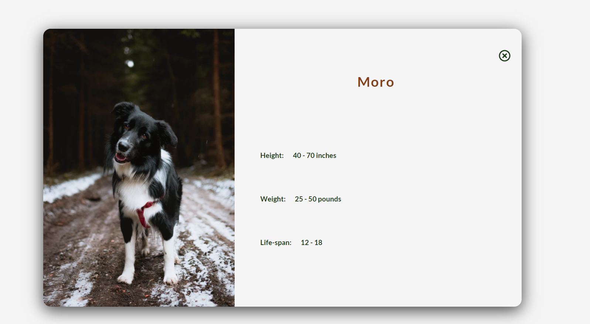
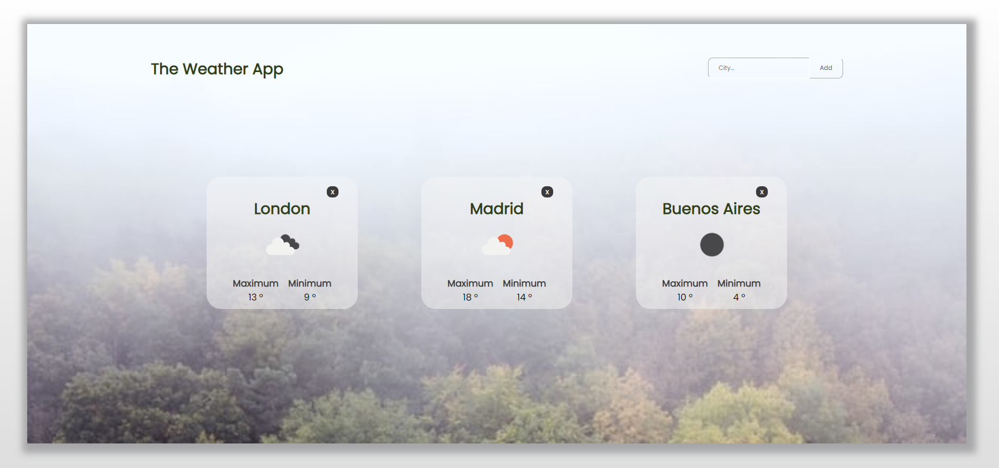
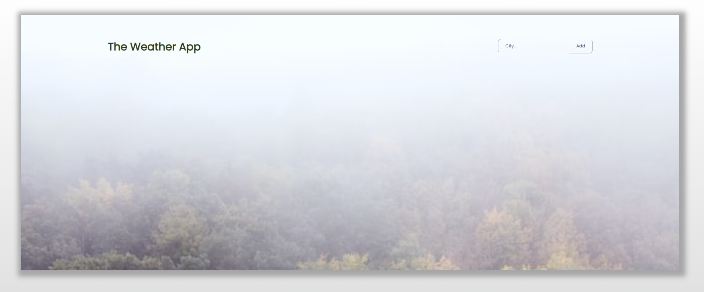

<h1 align="center">Hello there, I'm Magui Lococo</h1>
<h3 align="center">Full Stack Developer from Argentina 🧉</h3>

- 🧩 I’m currently working on **[My House App](https://my-house-app-one.vercel.app/)** --> repository [client](https://github.com/myhouseapp/client) & [server](https://github.com/my-house-app/api)

- 🌱 I’m learning **[Java](https://www.java.com)**

- ⚡ Fun fact -> **I love animals and I think [meerkats](https://www.youtube.com/watch?v=W4og8g_X22o) kind of describe me:**   tiny, active & social
 

<h3>Reach me at </h3>

magdalenalococo@gmail.com

 

<h2>Skills</h2>
    

      <a href="https://developer.mozilla.org/en-US/docs/Web/JavaScript" target="_blank">
        
        <!-- <small>Javascript</small> -->
      </a>
      <a href="https://reactjs.org/" target="_blank">
        
        <!-- <small>React</small> -->
      </a>
      <a href="https://nodejs.org" target="_blank">
        
        <!-- Node.js -->
      </a>
      <a href="https://redux.js.org" target="_blank">
        
        <!-- Redux -->
      </a>
    

    
    
      <a href="https://www.mysql.com/" target="_blank">
       
        <!-- MySql -->
      </a>
      <a href="https://www.w3schools.com/css/" target="_blank">
        
        <!-- CSS -->
      </a>
      <a href="https://git-scm.com/" target="_blank">
        
        <!-- Git -->
      </a>
      <a href="https://www.w3.org/html/" target="_blank">
        
        <!-- HTML -->
      </a>
      <a href="https://expressjs.com" target="_blank">
        
        <!-- Express -->
      </a>
      <a href="https://www.postgresql.org" target="_blank">
        
        <!-- PostgreSql -->
      </a>
    

    
      
      <a href="https://sequelize.org/" target="_blank">
        
        <!-- Sequelize -->
      </a> 
      <a href="https://www.sqlite.org/" target="_blank">
        
        <!-- SQLite -->
      </a>                                                                                                            
      <a href="https://getbootstrap.com" target="_blank">
        
        <!-- Bootstrap -->
      </a>
      <a href="https://www.java.com" target="_blank">
        
        <!-- Java -->
      </a>
    

<h2 align="left">My Projects</h2>

 <h3>My House App</h3>
  

    <a href="https://my-house-app-one.vercel.app/" target="_blank">                                                     
      <b>Visit our website and be ready to find the home you dream about!.</b> 
    </a>
    

        
    

    Developed with 5-member-team with Agile Methodologies (SCRUM and Github Boards). We used front-end and back-end technologies such as React, Redux, Node.js, Express, Sequelize and Postgress and incorporated Auth0 authentication + 2FA, Google Geocoding API, Google Maps & Street-View, Mercado Pago payment plataform and Administration Panel.
   
  <a href="https://my-house-app-one.vercel.app/" target="_blank"><b>Visit our site</b></a> --> repository <a href="https://github.com/myhouseapp/client" target="_blank">client</a> & </a><a href="https://github.com/my-house-app/api" target="_blank">server</a>
  

  

    
    
    
    
    
    
  

 
  <h3>DogApp</h3>
  

    <b>Meet the diversity of dogs in the world!</b> 
    This app was my final project in the Henry Bootcamp, developed with React, Redux, CSS modules, HTML in the front, and Node.js, Express, Sequelize and Postgress in the server side.
   
  <a href="https://dogapp.vercel.app/" target="_blank"><b>Try the app</b></a> --> repository <a href="https://github.com/maguilococo/DogApp_client" target="_blank">client</a> & </a><a href="https://github.com/maguilococo/DogApp-api"
  
  
  

    
    
    
    
    
    
    
  
    
   
  

   
  

  <h3>The Weather App</h3>
  

    <b>Check what's the weather like in any city of the world!</b> 
  This was my first app in React and CSS modules during the Henry Bootcamp
   
  <a href="#" target="_blank"><b>Start using the app</b></a> --><a href="https://github.com/maguilococo/FT-M2/tree/master/08-React-Estado-LifeCycle" target="_blank"> repository</a> 
  

  

    
    
  

